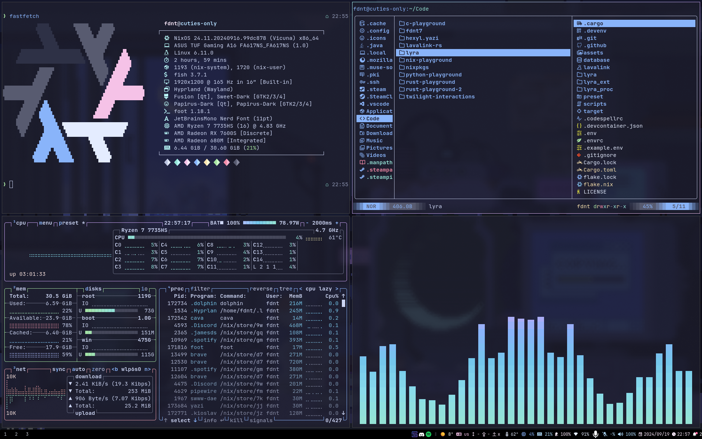

# NixOS Configuration

❄️ My NixOS Configuration Files.

This config is made with the template [`github:misterio77/nix-starter-config#minimal`](https://github.com/Misterio77/nix-starter-configs).

Screenshot (outdated)

